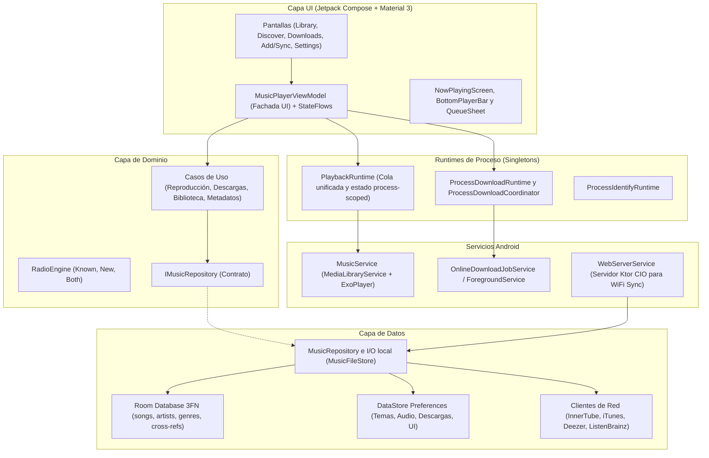

# BestiaPop

Reproductor de música para Android con biblioteca local, streaming, descargas, letras interactivas, radio inteligente, ListenBrainz y sincronización por WiFi.

**Estado:** beta · **Requisito:** Android 8.0 (API 26) o superior · **Versión:** [`version.properties`](version.properties)

[Descargar la última versión](https://github.com/axeldz05/bestia-pop/releases/latest)

Sin anuncios ni Analytics comercial; los builds release incluyen telemetría técnica anónima opcional contra cierres inesperados.

## Instalar

1. Abrí la [última release](https://github.com/axeldz05/bestia-pop/releases/latest).
2. Descargá `BestiaPop-*.apk`.
3. Permití **Instalar apps desconocidas** para el navegador o gestor de archivos.
4. Abrí el APK e instalalo.
5. Concedé acceso al audio y a las notificaciones cuando la app lo solicite.

Las actualizaciones siguientes se instalan desde **Ajustes → Actualización → Buscar actualización** o descargando un APK nuevo. **Ajustes → Invitar amigos** genera un código QR dinámico y enlace directo para compartir la app con otros dispositivos.

> Algunos fabricantes podrían imponer restricciones de batería que corten la música en segundo plano; en esos dispositivos, configurá BestiaPop como “Sin restricciones”.

## Primeros pasos

1. En el primer arranque, esperá a que finalice la indexación inicial de la biblioteca.
2. Tocá cualquier canción o usá los botones de Play o Shuffle en álbumes, artistas, géneros o playlists.
3. Desde **Añadir**, subí canciones por WiFi, importá carpetas locales o descargá audios mediante enlaces directos.
4. Explorá la pestaña **Descubrir** para buscar en el catálogo online, escuchar en streaming o guardar álbumes completos.
5. Abrí el mini reproductor para acceder a la vista Now Playing con selector de carátula y letras, cola deslizable y controles de radio.
6. Deslizá lateralmente sobre cualquier elemento de la biblioteca o de descubrir para encolarlo rápidamente sin interrumpir tu música.

La barra inferior reúne **Biblioteca**, **Descubrir**, **Descargas**, **Añadir** y **Ajustes**. La navegación respeta el botón atrás retrocediendo jerárquicamente un nivel por toque, exigiendo doble pulsación en la raíz para salir sin cortar la reproducción.

## Arquitectura

### Diagrama de arquitectura



## Funciones principales

### Biblioteca y exploración

- Exploración por **Canciones**, **Álbumes**, **Artistas**, **Géneros**, **Playlists** y **Recientes** mediante chips configurables y reordenables.
- Vistas alternables entre lista plana y agrupación visual por álbum con cabeceras colapsables.
- Ordenamiento ascendente o descendente por título, artista, álbum, género o fecha de agregado.
- Riel lateral de scroll rápido con respuesta háptica, orden natural alfanumérico y romanización automática para títulos bilingües.
- Deslizamiento lateral interactivo sobre canciones, álbumes, artistas, géneros y playlists para encolar o reproducir inmediatamente.
- Selección múltiple persistente durante la búsqueda para edición masiva, creación de playlists, búsqueda de similares o borrado.
- Identificación online de tags con soporte de títulos bilingües y revisión interactiva de discrepancias.
- Edición granular de metadatos locales y sincronización de carátulas almacenadas de forma aislada en almacenamiento privado.

### Now Playing, audio y letras

- Interfaz con selector de pestañas entre portada ampliada y letras interactivas, complementada con cola de reproducción deslizable.
- Búsqueda automática de letras locales o remotas con resaltado rítmico, auto-scroll y desplazamiento manual sincronizado al toque.
- Herramienta de guía fonética con romanización automática (Rōmaji, Hiragana, Cirílico) y traducción de líneas en tiempo real.
- Editor integrado de letras sincronizadas para ajustar marcas de tiempo sobre pistas locales y exportar archivos `.lrc` compañeros.
- Transiciones continuas con crossfade ajustable entre 1 y 10 segundos con protección automática para temas cortos.
- Modo aleatorio con repetición infinita que reshufflea la cola limpiamente sin generar interrupciones perceptibles.
- Amplificación de volumen por encima del 100% (hasta 200%) mediante botones físicos y balance estéreo L/R independiente.
- Decodificación prioritaria por hardware en el reproductor ExoPlayer con fallback seguro a decodificadores estándar por software.

### Descubrir, streaming y descargas

- Catálogo online integrado con buscador unificado, historial de hasta 100 consultas y sugerencias rápidas en chips.
- Exploración de álbumes, playlists, canciones, charts y géneros con metadatos estructurados de Deezer e iTunes.
- Streaming continuo y descarga de audio resueltos directamente mediante perfiles móviles de YouTube InnerTube.
- Descargas coordinadas en un semáforo global con un máximo de 3 transferencias simultáneas divididas entre explícitas y automáticas.
- Extracción de fragmentos de audio mediante peticiones HTTP `Range` cerradas para evitar bloqueos del CDN de streaming.
- Re-extracción obligatoria de enlaces caducados antes de descargar para prevenir errores de autorización HTTP 403.
- Gestión de descargas mediante User-Initiated Data Transfer (UIDT) en Android 14+ y Foreground Service en versiones anteriores.
- Persistencia de transferencias incompletas y reanudación automática al recuperar conectividad o reiniciar la app.

### Playlists, Radio y ListenBrainz

- Playlists locales con soporte de duplicados, reordenamiento interactivo por arrastre y carátula independiente que no altera sus canciones.
- Motor de radio inteligente que combina canciones locales y descubrimientos remotos en modos Solo conocidos, Solo nuevos o Mixto.
- Scrobbling oficial con ListenBrainz sincronizando reproducciones locales y encolando escuchas sin conexión para envío diferido.
- Secciones personalizadas Para Ti y Recomendados que integran pistas locales con descubrimientos remotos basados en tu perfil musical.
- Función Guardar al escuchar para descargar automáticamente en segundo plano pistas reproducidas por streaming sin consumir datos extras.

### Añadir y WiFi Sync

- Pestaña unificada que centraliza la importación de carpetas locales, la descarga por enlaces directos y la sincronización inalámbrica.
- Servidor web HTTP embebido sobre Ktor CIO para transferir archivos de audio desde cualquier navegador en la misma red local.
- Detección de duplicados, validación estricta de cabeceras de origen y límite de carga en transferencias entrantes.
- Ejecución en segundo plano protegida como Foreground Service con apagado automático si el usuario descarta la app.

### Modo sin conexión y estabilidad

- Modo sin conexión conmutable que corta todo tráfico a internet y oculta elementos remotos para uso estrictamente local.
- Monitor interno de estabilidad que registra de forma anónima presiones críticas de memoria y bloqueos para prevenir cierres por LMK.
- Aislamiento completo sin rastreadores de publicidad comercial, frameworks de analytics invasivos ni uso de identificadores publicitarios.

## Decisiones de diseño

- **Colecciones unificadas:** Álbumes, artistas y listas comparten pipeline único con slots efímeros para duplicados, centralizando shuffle y fallbacks sin rutas divergentes.
- **Normalización de Room en 3FN:** Artistas y géneros residen en tablas relacionales con claves de identidad canónicas, eliminando inconsistencias y anomalías de edición en metadatos compartidos.
- **Desacoplamiento Catálogo ≠ Audio:** Metadatos de iTunes/Deezer y streams de YouTube resuelven URLs en memoria al vuelo, evitando almacenar tokens CDN efímeros propensos a caducar.
- **Runtimes de proceso desacoplados de la UI:** Coordinadores de reproducción y descargas operan como singletons fuera de la actividad, asegurando continuidad en segundo plano y previniendo fugas de memoria.
- **Hub semántico compartido (TrackIdentity):** Toda entidad de audio implementa interfaz común de metadatos, impidiendo descomposición en parámetros primitivos sueltos a lo largo de llamadas intermedias.
- **Aislamiento de portadas entre entidades:** Álbumes y listas gestionan carátulas en almacenamiento privado dedicado, impidiendo que personalizar una colección sobrescriba el arte original de sus canciones.

## Datos, privacidad y límites

- La aplicación no incorpora anuncios publicitarios, librerías de Firebase Analytics ni lecturas del Advertising ID.
- El reporte de errores mediante Crashlytics funciona de forma opcional y exclusivamente en compilaciones de producción.
- Las playlists, preferencias y sobrescrituras de metadatos se almacenan localmente en la base de datos privada de la app.
- Los archivos de audio descargados residen en `Music/BestiaPop` y permanecen accesibles en el almacenamiento tras reinstalar.
- Las URLs del CDN de YouTube tienen una vida útil corta y nunca se persisten en Room ni en DataStore.
- La extracción de audio depende de la API interna InnerTube de YouTube, cuyos cambios externos pueden requerir actualizaciones periódicas.

## Solución de problemas

- **La aplicación no instala:** habilitá la opción de instalar aplicaciones desconocidas en el navegador o administrador de archivos utilizado.
- **La reproducción se detiene al apagar la pantalla:** desactivá las optimizaciones automáticas de batería del fabricante para BestiaPop.
- **Una descarga devuelve error 403 o se interrumpe:** verificá la conexión y reintentá desde la pestaña Descargas para obtener un enlace nuevo.
- **No se detectan actualizaciones disponibles:** asegurate de usar una compilación release y contar con acceso a internet.
- **La biblioteca aparece vacía tras reinstalar:** confirmá que tus archivos continúen en `Music/BestiaPop` y ejecutá una importación de carpeta.

## Desarrollo

### Requisitos

- JDK 17
- Android SDK con compile y target SDK en API 36
- Gradle instalado localmente en el entorno
- Conexión por `adb` a un dispositivo físico o emulador Android

```bash
git clone https://github.com/axeldz05/bestia-pop.git
cd bestia-pop
```

Configurá `app/google-services.json` desde Firebase Console para habilitar Crashlytics en compilaciones firmadas.

Para compilar e instalar en un dispositivo conectado:

```bash
./install.sh              # Compilación e instalación debug
./install.sh --release    # Compilación e instalación release local
```

El script de instalación compila el proyecto, despliega el APK mediante ADB, inicia la actividad principal y ajusta permisos de segundo plano.

Para firmar lanzamientos de producción se utiliza `keystore.properties`:

```properties
storeFile=ruta/al/keystore.jks
storePassword=contrasenia_almacen
keyAlias=alias_clave
keyPassword=contrasenia_clave
```

### Pruebas y cobertura

```bash
gradle :app:testDebugUnitTest            # Pruebas unitarias en la JVM
gradle :app:connectedDebugAndroidTest    # Pruebas instrumentadas en dispositivo

./coverage.sh                            # Reporte de cobertura unitaria
./coverage.sh --android                  # Reporte de cobertura instrumentada
./coverage.sh --all                      # Reporte combinado completo
```

Pruebas avanzadas de ciclo de vida disponibles en el directorio `scripts/`:

- `scripts/run-playback-process-death-e2e.sh`: muerte de proceso durante la reproducción.
- `scripts/run-playback-task-removal-e2e.sh`: descarte de la aplicación desde la lista de tareas recientes.
- `scripts/run-backup-restore-e2e.sh`: respaldo y restauración de datos.
- `scripts/run-library-permission-denied-e2e.sh`: comportamiento ante denegación de permisos de almacenamiento.

### Publicación de releases

La distribución de actualizaciones se realiza directamente a través de GitHub Releases:

```bash
./release.sh --dry-run   # Simulación para validar versión y notas
./release.sh             # Compilación release, firma, tag y publicación en GitHub
```

El comando automatiza el incremento de versión en `version.properties`, compila el binario en `dist/` y genera la release en el repositorio remoto.

## Estructura del código

Proyecto estructurado en un único módulo Android `:app` bajo el paquete raíz `com.bestiapop.android`:

```text
ui/          Interfaces Jetpack Compose, componentes reutilizables, temas y ViewModels
domain/      Casos de uso de negocio, contratos de repositorios y motor de radio
data/        Implementación de repositorios, Room, clientes de red, modelos y DataStore
service/     Servicio de reproducción Media3, coordinadores de descargas y servidor WiFi
```

Tecnologías principales: Kotlin, Jetpack Compose, Material 3, AndroidX Media3 ExoPlayer, Room, DataStore, OkHttp, Ktor y Coil.

## Créditos y dependencias

La resolución de flujos de YouTube es una implementación nativa en Kotlin inspirada en los extractores mantenidos por la comunidad de [yt-dlp](https://github.com/yt-dlp/yt-dlp). BestiaPop no ejecuta binarios externos de yt-dlp.

La información de catálogo musical se obtiene de iTunes y Deezer; el historial de reproducciones y sugerencias se integran con ListenBrainz.

## Licencia

Este proyecto está bajo la licencia [GNU Affero General Public License v3.0](LICENSE).
