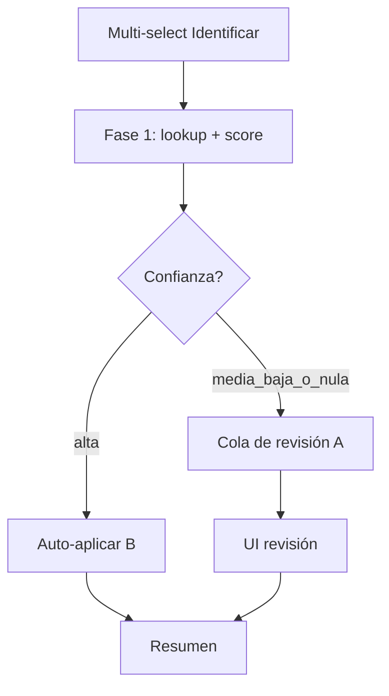

# Plan: extender Identificar (B) con revisión de candidatos (A)

## Objetivo

Mantener el flujo actual (**B**: auto-aplicar mejor match en lote) y añadir una capa de **revisión manual de candidatos (A)** solo donde haga falta, de modo que:

- 94 canciones no obliguen a 94 pantallas si el match es claro.
- Cuando haya duda, el usuario vea **pocos candidatos claros y precisos** (no una lista genérica de 25).
- Se pueda corregir un auto-apply incorrecto sin rehacer todo el lote.

---

## Estado actual (B)

| Pieza | Hoy |
|-------|-----|
| Entrada UI | Multi-select → `onIdentifySelected` → `identifySongs` |
| Repo | `identifySongMetadata(song)` → 1 hit (`fetchFullTrackMetadata` o 1º de `searchOnlineCatalog`) → escribe Room |
| Resultado | `IdentifyResult.Updated` / `NoMatch` / `Skipped` |
| Feedback | `LibraryProgressBanner` + toast resumen |

**Hueco:** no hay score de confianza, no se exponen candidatos, no hay UI de revisión, un falso positivo se aplica igual que un match perfecto.

---

## Principio de producto: “auto cuando es seguro, revisar cuando no”

No reemplazar B por un wizard canción-a-canción. Extender B a un pipeline en **dos fases**:



**Regla de oro UX:** el usuario solo toca canciones ambiguas. Las claras desaparecen en silencio (con conteo en el resumen).

---

## Fase 1 — Lookup enriquecido (sin UI todavía)

### 1.1 API nueva (no romper la actual)

Separar “buscar” de “aplicar”:

```kotlin
// Propuesta
suspend fun proposeSongIdentity(song: Song): IdentifyProposal
suspend fun applySongIdentity(songId: Long, candidate: IdentifyCandidate): IdentifyResult
// identifySongMetadata(song) puede quedar como wrapper: propose + auto-apply si HIGH
```

Modelos sugeridos (`Models.kt` / dominio):

```kotlin
data class IdentifyCandidate(
  val title: String,
  val artist: String,
  val album: String,
  val artworkUrl: String?,
  val durationMs: Long,
  val provider: String,          // Deezer | iTunes | …
  val score: Float,              // 0f..1f
  val reasons: List<String>      // UI: "título exacto", "duración ±2s"
)

enum class IdentifyConfidence { HIGH, MEDIUM, LOW, NONE }

data class IdentifyProposal(
  val songId: Long,
  val queryArtist: String,
  val queryTitle: String,
  val sourceHints: String?,      // filename hint mostrado en UI
  val candidates: List<IdentifyCandidate>, // ya rankeados, top N
  val confidence: IdentifyConfidence,
  val suggested: IdentifyCandidate?        // candidates.firstOrNull()
)
```

### 1.2 Ranking / precisión (crítico para buena UX)

Hoy se toma el primer hit. Pasar a **score multi-señal** y devolver top 3–5 (nunca 25 crudos).

Señales (pesos orientativos):

| Señal | Peso | Notas |
|-------|------|--------|
| Similaridad título (normalizado) | alto | quitar feat./remaster/official audio; `TrackMatchKeys.normalize` o equivalente |
| Similaridad artista | alto | si query artist no es Unknown; si es Unknown, no penalizar fuerte el primero |
| Duración vs archivo (±2–3 s) | medio-alto | desempate fuerte cuando hay tags de duración |
| Coincidencia álbum no vacío / no genérico | medio | “Single” / “YouTube Music” bajan score |
| Provider preferido | bajo | Deezer ≈ iTunes delante de YT search |
| Filename hint alineado | medio | si `Artist_Title` coincide con candidato |

Umbrales sugeridos (ajustables con tests):

- **HIGH:** score ≥ 0.85 **y** gap al 2º ≥ 0.12 → auto-apply.
- **MEDIUM:** score ≥ 0.55 o gap pequeño → revisión.
- **LOW:** hay candidatos pero score bajo → revisión con aviso.
- **NONE:** sin candidatos → revisión “buscar otro” / omitir.

Deduplicar candidatos por `(normalize(artist), normalize(title), normalize(album))` antes de rankear.

### 1.3 Fuentes de candidatos

Orden de fetch (reutilizar stack existente):

1. `MetadataFetcher.searchOnlineCatalog(query)` — lista, no solo `first()`.
2. Si artist conocido: también query `"artist title"` y merge.
3. Opcional fase 2: ListenBrainz `lookupRecordingMetadata` cuando haya token (más preciso en edge cases).

Concurrencia: Semaphore(2–3) como descargas; progreso con `LibraryJobKind.IDENTIFY` (`Buscando 12/94…`).

---

## Fase 2 — Experiencia de revisión (A, no tediosa)

### 2.1 Cuándo abrir UI de revisión

Tras Fase 1:

1. Auto-aplicar todos los **HIGH**.
2. Si la cola `MEDIUM + LOW + NONE` está **vacía** → solo toast (comportamiento B mejorado).
3. Si hay ítems → abrir **pantalla/sheet de revisión** (no un AlertDialog por canción).

Para lotes grandes, **nunca** forzar “Siguiente” 94 veces sin atajos.

### 2.2 Layout de revisión (una composición clara)

Pantalla full-screen o bottom sheet alto (`IdentifyReviewScreen`):

**Cabecera fija**

- Progreso: `Revisar 3 de 18` (solo las ambiguas; las auto ya no cuentan).
- Acciones globales: `Omitir todas` · `Aplicar sugeridos restantes` (solo MEDIUM con suggested).

**Cuerpo — canción actual**

- Bloque “Tu archivo”: título actual, artist/album Unknown, duración, artwork si hay, **hint de filename** (`Radiohead · Creep` parseado).
- Lista de **máximo 3–5 candidatos**, cada uno como fila rica (no card clutter):
  - Portada 48–56dp
  - Título · Artista
  - Álbum · año/duración si hay
  - Chip corto de confianza (`Alta` / `Posible`) + 1 reason (`duración +1s`)
- El primer candidato viene **preseleccionado** (suggested) para 1 tap “Usar”.

**Pie**

- `Usar este` (primario)
- `Omitir`
- `Buscar otro…` (abre campo query editable + re-fetch de candidatos para **esta** canción)
- Opcional: play preview del archivo local (ayuda a decidir sin salir)

### 2.3 Atajos anti-tedio (imprescindibles con muchas canciones)

| Atajo | Comportamiento |
|-------|----------------|
| `Aplicar sugeridos restantes` | Aplica `suggested` en todos los MEDIUM restantes; deja LOW/NONE |
| `Omitir todas` | Cierra cola sin cambios en pendientes |
| Swipe / teclas | Siguiente omitiendo / aplicando suggested |
| Agrupar por artista sugerido | Si 8 tracks proponen el mismo artist+album, ofrecer “Aplicar este álbum a estas 8” (batch confirm) |
| Revisión diferida | Guardar cola en memoria/VM; banner “18 por revisar” en biblioteca para retomar |

**Agrupación por álbum (mayor win UX):** tras ranking, clusterear propuestas MEDIUM que compartan `(artist, album)` sugerido. Una tarjeta de grupo:

> 6 canciones → *OK Computer* · Radiohead  
> [Ver lista] [Aplicar a todas] [Revisar una a una]

Eso convierte 6 decisiones en 1 cuando el catálogo es coherente.

### 2.4 Corregir falsos positivos de B

En el toast/resumen post-lote:

> `71 actualizadas · 18 para revisar · 5 sin match`  
> Acción: `Revisar` · `Deshacer últimas auto` (opcional, scope: songIds auto-aplicados en esta sesión)

Menú canción (⋮) → `Identificar…` / `Cambiar identidad` abre la misma UI de revisión para **1** canción (reutiliza A sin multi-select).

---

## Flujo de usuario completo (ejemplo 94 Unknown)

1. Usuario selecciona Unknown Album → Identificar.
2. Banner: `Identificando 40/94…` (lookup).
3. Sistema auto-aplica 71 HIGH.
4. Abre revisión: `18 para revisar` (12 MEDIUM + 4 LOW + 2 NONE).
5. Usuario ve grupo “6 × Absolution · Muse” → Aplicar a todas.
6. Revisa 8 sueltas eligiendo candidato 1 o 2; 2 NONE → Buscar otro con query editada; 2 omite.
7. Resumen final: `85 actualizadas · 2 omitidas · 7 sin match`.

Tiempo percibido: minutos, no una hora de diálogos.

---

## Cambios técnicos por capa

### Data / network

- `MetadataFetcher`: exponer búsqueda que devuelva lista tipada + campos para score (ya casi con `OnlineCatalogTrack`).
- Helper puro `IdentifyRanking.score(query, fileDuration, candidate) → Float` + tests unitarios (casos: exacto, feat., duración mismatch, artist unknown).
- `MusicRepository.proposeSongIdentity` / `applySongIdentity`; `identifySongMetadata` delega a propose+apply si HIGH (compat).

### Domain

- Use case opcional `IdentifySongsUseCase` orquestando lote, split confianza, apply batch.
- No meter ranking en el ViewModel.

### UI / VM

- `identifySongs(songs)` → Fase 1 → `_identifyReviewQueue` + auto counts → navega/abre review si cola no vacía.
- Estado: `IdentifyReviewState(currentIndex, items, selectedCandidateIndex, isSearching)`.
- Componentes: `IdentifyReviewScreen`, `IdentifyCandidateRow`, `IdentifyAlbumGroupCard`.
- Reutilizar `ArtworkThumbnail`, patrones de `AddMusicDialog` / filas de catálogo donde aporten.

### Progreso

- Extender labels: `Identificando…` (lookup) → `Aplicando…` (auto) → banner o progreso interno en review (`3/18`).
- `LibraryJobKind` puede sumar `IDENTIFY_REVIEW` o reutilizar IDENTIFY con label distinto.

### Docs vivos

- Actualizar `bestiapop-features` §6 e `implementation-map` al implementar (candidatos, confianza, review UI).

---

## Precisión: checklist de calidad de candidatos

Antes de mostrar un candidato en UI A:

1. Título normalizado no vacío.
2. Artista no placeholder.
3. Álbum preferible; si falta, etiquetar como “Single / sin álbum” (no inventar nombre falso en la fila).
4. Portada si existe (ayuda decisión visual).
5. Duración visible si hay ambas (archivo vs candidato).
6. Máximo 5; si el 4º y 5º están score &lt; 0.4 respecto al 1º, ocultarlos (“mostrar más”).

Evitar ruido YouTube genérico en la lista de identidad salvo que Deezer/iTunes fallen (provider de último recurso, chip “YouTube”).

---

## Fases de implementación sugeridas

### P0 — Fundaciones (sin UI A completa)

1. `IdentifyCandidate` + ranking + `proposeSongIdentity`.
2. Auto-apply solo HIGH; MEDIUM/LOW/NONE cuentan como “para revisar” en toast (aunque aún no haya pantalla).
3. Tests de ranking.

### P1 — Review mínima viable

1. `IdentifyReviewScreen` una canción a la vez (cola).
2. Usar / Omitir / Buscar otro.
3. Entrada desde multi-select y desde menú ⋮.

### P2 — Anti-tedio

1. Aplicar sugeridos restantes.
2. Agrupar por álbum sugerido.
3. Banner “N por revisar” + retomar.
4. Deshacer auto de la sesión (opcional).

### P3 — Precisión extra

1. ListenBrainz lookup cuando haya token.
2. Ajuste fino de umbrales con telemetría local (counts HIGH/MEDIUM en log/Crashlytics non-fatal keys, sin PII).

---

## Fuera de alcance (sigue igual)

- Escribir tags ID3 al archivo al descargar (mejora paralela útil, no bloquea A).
- Wizard obligatorio para **todas** las canciones (anti-patrón con N grande).
- Reemplazar edición manual actual (`EditSongMetadataDialog`); A es sugerencia desde catálogo, no formulario libre (el form sigue para overrides finos).

---

## Criterios de éxito

- Lote ~100 Unknown: &lt; ~15 interacciones manuales típicas si hay muchos HIGH + grupos de álbum.
- Candidatos mostrados: ≤ 5, ordenados, con razón de score legible.
- Cero regresión: flujo B actual sigue funcionando cuando todo es HIGH (solo progreso + toast).
- Falso positivo auto-aplicado recuperable vía “Cambiar identidad” en la canción.

---

## Decisión de diseño fijada

**Híbrido B→A por confianza**, no A puro ni B puro.  
Revisión en **cola/pantalla única** con agrupación por álbum, no dialogs serializados.  
Precisión vía **ranking multi-señal + top-N**, no “primer resultado del API”.
