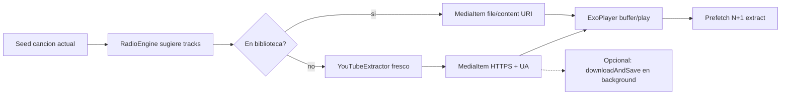

# Radio + stream — plan de implementación

Plan para cubrir lo que quedó **fuera de alcance** de ListenBrainz Para Ti, con foco en reproducir música en modo Radio **sin esperar a que se descargue toda la canción**.

## Contexto actual

| Pieza | Estado hoy |
|-------|------------|
| Scrobbling ListenBrainz | Implementado (`ListenTracker`, `ListenSyncCoordinator`, `ListenBrainzClient.submitListens`) |
| Para Ti (Discover `createdfor`) | Implementado: lista + detalle + match local; faltantes = “No en biblioteca” |
| Descarga online | **Download-then-play**: `YouTubeExtractor.extractAudioStreamDetailed` → OkHttp baja el archivo completo → Room + `/Music/BestiaPop/` |
| Reproducción | Media3 ExoPlayer; `songToMediaItem` / `parseToMediaUri` **ya aceptan** `http(s)://`, pero la cola solo recibe paths locales |
| Radio / similares | No existe |
| Import LB → playlist Room | No existe |
| CF recommendations | No existe |

**Invariante vigente:** re-extraer URL CDN de YouTube justo antes de usarla (evita HTTP 403).

---

## Decisión clave: cómo no esperar la descarga

### Opciones evaluadas

| Enfoque | Latencia al play | Complejidad | Veredicto |
|---------|------------------|-------------|-----------|
| **A. Stream CDN → ExoPlayer** | Baja (~1–3 s de buffer) | Media | **Elegido** |
| B. Escribir archivo parcial y reproducirlo a la vez | Media–alta | Alta | Descartado (locks, formatos, frágil) |
| C. Media3 `SimpleCache` + `CacheDataSource` | Baja + cache disco | Alta | Diferido; útil después, no para v1 |

### Por qué A (stream-first)

1. Reutiliza `YouTubeExtractor` (misma extracción fresca + `userAgent` que la descarga).
2. ExoPlayer hace buffering progresivo nativo sobre HTTPS; el usuario escucha sin archivo completo.
3. Prefetch de la URL del siguiente track mientras suena el actual → Radio continuo.
4. La descarga a biblioteca queda **opcional y en background** (mismo `downloadAndSaveOnlineTrack`), sin bloquear el play.
5. `parseToMediaUri` ya contempla HTTP; falta cablear headers y un modelo de cola remoto.

### Riesgos y mitigaciones

| Riesgo | Mitigación |
|--------|------------|
| CDN googlevideo expira / 403 | Re-extraer just-in-time; al 403, re-extract + `replaceMediaItem`; no cachear URL en Room |
| User-Agent incorrecto | Guardar `userAgent` del extract en el `MediaItem` y aplicarlo en `HttpDataSource` de `MusicService` |
| Cold start lento | Prefetch N+1 (y opcional N+2); mostrar “Resolviendo…” solo en el primer remoto |
| Contaminar biblioteca | Modelo `PlayableItem.Remote` efímero; no persistir `audioUrl` en `SongEntity` |
| Fallo de extract | Skip al siguiente ítem de la cola Radio / Para Ti |

---

## Flujo objetivo



---

## Modelo de datos (cola unificada)

No ensuciar `Song` de Room con URLs temporales.

```kotlin
sealed class PlayableItem {
    abstract val title: String
    abstract val artist: String
    abstract val artworkUri: String?
    abstract val durationMs: Long

    data class Local(val song: Song) : PlayableItem()
    data class Remote(
        val title: String,
        val artist: String,
        val album: String? = null,
        val artworkUri: String? = null,
        val durationMs: Long = 0,
        val recordingMbid: String? = null,
        val youtubeQueryOrId: String? = null, // null => buscar "artist title"
        val resolved: ResolvedStream? = null  // llenado por StreamResolver
    ) : PlayableItem()
}

data class ResolvedStream(
    val audioUrl: String,
    val userAgent: String,
    val videoId: String,
    val resolvedAtEpochMs: Long
)
```

- `playCollection` / cola del ViewModel pasan a operar sobre `List<PlayableItem>` (o wrapper paralelo sin romper APIs locales existentes: overload / adapter `Song → Local`).
- Conversión a `MediaItem`:
  - **Local:** igual que hoy (`uriString` file/content).
  - **Remote:** URI = `resolved.audioUrl`; tag/extras = `userAgent` (+ videoId).

---

## Fases de implementación

### Fase 1 — Infra de reproducción remota (bloqueante)

**Objetivo:** poder encolar y reproducir un remoto sin bajar el archivo entero.

#### 1.1 `StreamResolver` (`data/listenbrainz/` o `data/stream/`)

- Input: artist + title, o videoId / query YouTube.
- Llama `YouTubeExtractor.extractAudioStreamDetailed`.
- Cache en memoria: key = `videoId` o query normalizada; TTL ~3–5 min.
- API sugerida:
  - `suspend fun resolve(item: PlayableItem.Remote): Result<ResolvedStream>`
  - `suspend fun prefetch(items: List<PlayableItem.Remote>)`

#### 1.2 MediaItem + headers en `MusicService`

Archivo: [`app/src/main/java/com/bestiapop/android/service/MusicService.kt`](app/src/main/java/com/bestiapop/android/service/MusicService.kt)

- Configurar ExoPlayer con `DefaultMediaSourceFactory` + `HttpDataSource.Factory` que lea User-Agent (y headers necesarios) desde el `MediaItem` (tag / `RequestMetadata.extras`).
- Sin UA correcto, googlevideo suele fallar aunque la URL sea válida.

#### 1.3 ViewModel / cola

Archivo: [`MusicPlayerViewModel.kt`](app/src/main/java/com/bestiapop/android/ui/MusicPlayerViewModel.kt)

- Extender transición de ítem: si el próximo es `Remote` sin `resolved` fresco → resolver antes de que ExoPlayer lo pida (o al fallar).
- Prefetch: al empezar ítem índice `i`, resolver `i+1` (y opcional `i+2`) en `viewModelScope`.
- On player error (403/IO): una re-extracción; si ok, `replaceMediaItem`; si no, `seekToNext`.
- UI: estado opcional `resolvingRemote: Boolean` / mensaje breve.

#### 1.4 Fuera de Fase 1

- No `SimpleCache` todavía.
- No escribir en Room URLs CDN.
- No cambiar el flujo “Añadir música → descargar” existente (sigue download-then-play para persistencia explícita).

**Criterio de hecho:** reproducir una canción no local de punta a punta solo con stream + poder pasar a la siguiente con prefetch.

---

### Fase 2 — Modo Radio

**Objetivo:** “canciones parecidas a lo que suena”, offline primero, remotos cuando haga falta.

#### 2.1 Entry points UI

- Botón **Radio** en [`NowPlayingScreen.kt`](app/src/main/java/com/bestiapop/android/ui/screens/NowPlayingScreen.kt) (y/o menú del now playing).
- Seed = `currentSong` (debe ser `Local` o al menos tener artist+title).

#### 2.2 `RadioEngine` (puerto + providers)

Ubicación sugerida: `domain/usecase/` o `domain/radio/`.

```text
RadioEngine.suggest(seed, library, settings) → List<PlayableItem>
```

| Provider | Cuándo | Qué hace |
|----------|--------|----------|
| `LocalMetadataRadio` | Siempre | Score: mismo artista (alto), género, año ±5, álbum (bajo / anti-álbum-entero). Anti-repetición (cooldown de recientes). |
| `ListenBrainzRadio` | `enabled` + token + red | Resolver artist MBID (cache memoria); `GET /1/lb-radio/artist/{mbid}`; mapear a Local si match; si no → `Remote(artist, title)`. |

Modos (opcional UX, imitar LB easy/medium/hard):

- **Fácil:** casi solo biblioteca / mismo artista.
- **Exploración:** más peso a LB + remotos.

#### 2.3 Orquestación

- Generar tanda de 20–40 ítems.
- Reproducir vía pipeline unificado extendido (`playCollection` de `PlayableItem`).
- Al quedar < N ítems en cola, pedir otra tanda (misma seed o seed = track actual).
- Preferir no repetir lo tocado en la sesión Radio.

#### 2.4 Orden interno de Fase 2

1. **2a — Solo local** (valor inmediato offline, sin depender de stream).
2. **2b — + ListenBrainz + Remote** (requiere Fase 1 estable).

**Criterio de hecho 2a:** Radio desde now playing arma cola solo de lib y reproduce.  
**Criterio de hecho 2b:** aparecen remotos, suenan en stream, skip si fallan.

---

### Fase 3 — Faltantes de Para Ti con el mismo motor

**Objetivo:** las tracks “No en biblioteca” de Discover también se puedan escuchar.

Archivos: [`PlaylistsScreen.kt`](app/src/main/java/com/bestiapop/android/ui/screens/PlaylistsScreen.kt), ViewModel LB detail.

1. Al abrir/play/shuffle playlist LB: construir `List<PlayableItem>` (Local si match, Remote si no).
2. Reutilizar prefetch / 403 retry de Fase 1.
3. Badge UI: `N en biblioteca · M en stream` (o similar).
4. Toggle en ajustes LB o en detalle: **“Guardar al escuchar”**:
   - Tras umbral (p.ej. 30 s reproducidos o fin del tema), llamar `downloadAndSaveOnlineTrack` en background.
   - No pausar ni reemplazar el MediaItem en curso; al terminar, el archivo queda en lib para la próxima vez.
5. Filas remotas dejan de estar solo atenuadas: click → play desde esa posición (resolviendo stream).

**Criterio de hecho:** play/shuffle de Daily Jams con mezcla local+remota sin esperar descargas.

---

### Fase 4 — Importar playlist LB a Room

**Objetivo:** “Guardar como playlist local” desde una Discover.

1. Acción en detalle LB: crear `Playlist` + cross-refs solo para `PlayableItem.Local` actuales.
2. Remotos:
   - Opción A (simple): no se importan hasta que el usuario los haya guardado (Fase 3 toggle) o elija “Descargar faltantes” (batch download-then-play, progreso UI).
   - Opción B: import async — encolar descargas y `addSongToPlaylist` al completar.
3. Nunca persistir `audioUrl` CDN en `SongEntity`.

**Recomendación:** Opción A + botón explícito “Descargar faltantes e importar” para no sorprender con tráfico/almacenamiento.

---

### Fase 5 — Collaborative filtering (opcional, menor prioridad)

**Objetivo:** pool extra de recomendación.

- `GET /1/cf/recommendation/user/{username}/recording`
- Resolver metadata (título/artista) vía MusicBrainz/LB playlist-like lookup.
- Emitir `PlayableItem.Remote` / Local si match.
- UI: sección “Recomendados” bajo Para Ti, **o** alimentar modo Radio exploración.

**ROI:** menor que `createdfor` + Radio local/LB-radio; implementar solo si Fases 1–3 están sólidas.

---

## Orden de implementación recomendado

1. **Fase 1** — stream + UA + prefetch + 403 retry  
2. **Fase 2a** — Radio solo biblioteca  
3. **Fase 2b** — Radio + LB + remotos  
4. **Fase 3** — Para Ti mixto + guardar al escuchar  
5. **Fase 4** — Import a Room  
6. **Fase 5** — CF recommendations (opcional)

---

## Archivos principales a tocar

| Concern | Paths |
|---------|--------|
| Extract / stream | `data/network/YouTubeExtractor.kt`, nuevo `StreamResolver` |
| Player HTTP headers | `service/MusicService.kt` |
| Cola / MediaItem | `ui/MusicPlayerViewModel.kt` |
| Radio domain | nuevo `domain/.../RadioEngine` (+ providers local / LB) |
| LB radio API | `data/network/ListenBrainzClient.kt` (`lb-radio/artist/...`) |
| Para Ti UI | `ui/screens/PlaylistsScreen.kt` |
| Now Playing | `ui/screens/NowPlayingScreen.kt` |
| Prefs (toggles) | `ListenBrainzPreferencesRepository` / settings screen |
| Descarga (sin cambiar contrato) | `MusicRepository.downloadAndSaveOnlineTrack` |
| Docs vivas | `.cursor/skills/bestiapop-{features,architecture,implementation-map}/SKILL.md` |

---

## Qué no hacer

- Esperar descarga completa antes del primer play en Radio / Para Ti remoto.
- Guardar URLs googlevideo en Room (`SongEntity.uriString`).
- Progressive write-to-file + play del mismo archivo en v1.
- Inventar un segundo pipeline de cola paralelo al de colecciones: **extender** el unificado.
- Bloquear Fase 2a (Radio local) esperando stream perfecto: puede shippear antes.

---

## Docs vivas (al implementar cada fase)

Actualizar en el mismo cambio de código:

- **features:** Radio; stream remoto; Para Ti mixto; import; CF si aplica.
- **architecture:** cola `Local|Remote`, `HttpDataSource` en `MusicService`, `StreamResolver`.
- **implementation-map:** paths/símbolos nuevos.

---

## Criterios de aceptación globales

- [ ] Radio desde una canción local genera cola y reproduce sin red (2a).
- [ ] Un track remoto empieza a sonar sin archivo completo en disco (Fase 1).
- [ ] Al fallar CDN/403, se reintenta extract una vez o se salta al siguiente.
- [ ] Prefetch evita silencio largo entre tracks remotos en condiciones normales.
- [ ] Para Ti puede reproducir faltantes por stream (Fase 3).
- [ ] “Guardar al escuchar” / import no bloquean la reproducción en curso.
- [ ] Ninguna URL CDN queda persistida en Room.

---

## Fuera de este plan

- Motor de similitud por audio embeddings / fingerprint on-device.
- Sustituir el flujo explícito “Descargar” del diálogo Añadir música (sigue siendo download-then-play).
- Radio que descargue automáticamente toda la tanda a disco.
