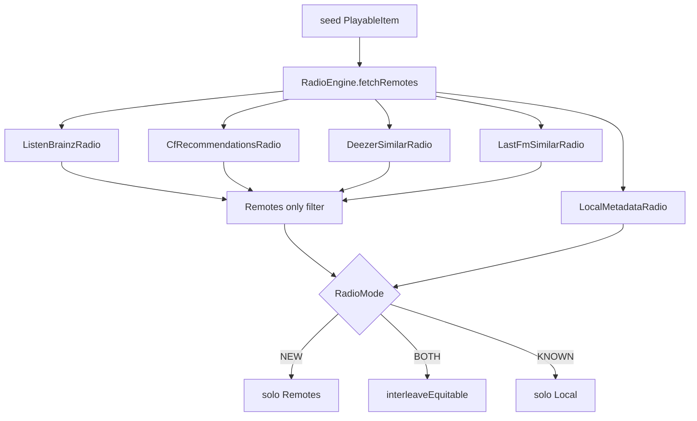

# Plan: Radio de similares sin depender solo de ListenBrainz

Documento de diseño para **Opción 1** (reutilizar stack catálogo + mejorar local) y **Opción 2** (Last.fm + enriquecimiento MusicBrainz). Encaja con la arquitectura BestiaPop actual (`ui` → `domain/radio` → `data/network`) y con los invariantes de Radio / catálogo ≠ audio.

**Fuera de alcance de este plan:** MusicAtlas, FreqBlog, Spotify OAuth, embeddings on-device (opción 3–4 del análisis previo).

---

## Visión y restricciones (no negociables)

| Principio | Implicación para similares |
|-----------|----------------------------|
| Catálogo ≠ audio | Deezer / iTunes / Last.fm / MusicBrainz solo aportan **metadatos** (artist, title, artwork opcional). El stream sigue siendo YouTube vía `StreamResolver` / `YouTubeExtractor`. |
| Cola unificada | Toda sugerencia es `PlayableItem.Local` o `PlayableItem.Remote`. Sin pipelines de reproducción paralelos. |
| Radio orquestada | Un solo `RadioEngine.suggest`; nuevos providers se enchufan como fill, no como “otra radio” en UI. |
| Remoto efímero | Nunca persistir CDN YouTube en Room; `Remote` con `youtubeQueryOrId = "$artist $title"`. |
| Solo nuevos = Remotes | En `RadioMode.NEW`, omitir matches de biblioteca (igual que hoy con LB). |
| Ambos = interleave | `interleaveEquitable(online, offline)` se mantiene; solo cambia de dónde sale el pool `online`. |
| Living docs | Al implementar: actualizar `bestiapop-features`, `bestiapop-implementation-map`, y si hace falta `bestiapop-architecture`. |

### Modos actuales (contexto)

```
KNOWN  → LocalMetadataRadio
NEW    → Remotes: hoy LB → CF; objetivo: LB → CF → [nuevos providers] (+ retry)
BOTH   → interleave(Remotes, Local)
```

Default sin preferred: `BOTH` si hay credenciales LB + red; si no, `KNOWN`. Tras Opción 1/2, “hay online usable” debería incluir Deezer/Last.fm **sin** exigir token LB.

---

## Arquitectura objetivo



**Contrato común de provider** (nuevo, en `domain/radio`):

```kotlin
interface SimilarTracksProvider {
    /** Nombre corto para logs / telemetría interna (no UI). */
    val id: String

    suspend fun suggest(
        seed: PlayableItem,
        library: List<Song>,
        excludeKeys: Set<String>,
        limit: Int
    ): List<PlayableItem>
}
```

- `ListenBrainzRadio` / `CfRecommendationsRadio` / nuevos providers implementan o se adaptan a este contrato (o un wrapper fino).
- `RadioEngine` recibe `List<SimilarTracksProvider>` ordenada por prioridad + `LocalMetadataRadio` aparte.
- Dedup global por `matchKey(artist, title)` + `mediaId` (igual que hoy).
- En modos NEW/BOTH, `fetchRemotes` solo acumula `PlayableItem.Remote`.

**Capas:**

| Capa | Qué va |
|------|--------|
| `data/network/` | Clientes HTTP (Deezer endpoints nuevos, Last.fm, MusicBrainz lookup). Reusar OkHttp / patrones de `MetadataFetcher` / `ListenBrainzClient`. |
| `domain/radio/` | `DeezerSimilarRadio`, `LastFmSimilarRadio`, scoring local mejorado; orquestación en `RadioEngine`. |
| `ui/` | Sin pantallas nuevas de provider. Como mucho: toast/status ya existentes; settings solo si hace falta API key Last.fm. |
| Preferencias | Last.fm API key (Opción 2). Deezer público no requiere key hoy (igual que catálogo). |

---

## Opción 1 — Stack propio (Deezer + iTunes fill + local mejorado)

**Objetivo:** que Solo nuevos / Ambos funcionen **sin ListenBrainz**, reutilizando el catálogo que ya usás.

### 1.A Deezer similar / radio de artista

**API (pública, ya usada en catálogo):**

1. Resolver artista seed:  
   `GET https://api.deezer.com/search/artist?q={artist}&limit=1`  
   → `artist.id` (ya hay patrón en `MetadataFetcher.fetchArtistPhotoUrl`).
2. Tracks “radio” del artista:  
   `GET https://api.deezer.com/artist/{id}/radio`  
   → lista de tracks (título, artista, álbum, cover).
3. Artistas relacionados (diversidad):  
   `GET https://api.deezer.com/artist/{id}/related?limit=N`  
   → para cada related (cap ~3–5): `artist/{id}/top?limit=M` o otra llamada a `/radio`.

**Mapeo a dominio:**

```kotlin
PlayableItem.Remote(
    title = ...,
    artist = ...,
    album = ...,
    artworkUri = coverUrl?,  // opcional; no persistir
    youtubeQueryOrId = "$artist $title"
)
```

Si `matchKey` está en `library` → en NEW se **omite**; en un futuro fill “inteligente” de BOTH podría preferirse Local, pero el filtro Remote-only de `fetchRemotes` ya unifica el comportamiento.

**Archivos nuevos / tocados:**

| Archivo | Rol |
|---------|-----|
| `data/network/MetadataFetcher.kt` (o `DeezerClient.kt` si crece) | `resolveArtistId`, `fetchArtistRadio`, `fetchRelatedArtists`, `fetchArtistTop` |
| `domain/radio/DeezerSimilarRadio.kt` | Implementa suggest; cache en memoria TTL ~20 min (como CF) |
| `domain/radio/RadioEngine.kt` | Tras LB/CF (o si LB no disponible), llamar Deezer hasta `limit` |
| `MusicPlayerViewModel` wiring | Inyectar provider al construir `RadioEngine` |
| Tests | `DeezerSimilarRadioTest` / parse JSON fixtures; ajustar `RadioEngineTest` (NEW sin LB llena con Deezer) |

**Prioridad en `fetchRemotes` (propuesta):**

1. ListenBrainz (si token + red)  
2. CF (si username + token)  
3. **DeezerSimilarRadio** (si red; sin token)  
4. (Opción 2) Last.fm  

Así LB sigue siendo “mejor señal” cuando está; Deezer evita el vacío que hoy dispara retry/toast.

**Disponibilidad online sin LB:**

- `suggestRadioWithRetry` / default mode: considerar “online usable” = red **y** (LB credentials **o** Deezer reachable).  
- NEW sin LB: no toast inmediato por falta de token; intentar Deezer (+ retry).  
- Toast “Radio online no disponible” solo si tras timeout no hay Remotes de ningún provider.

### 1.B iTunes como fill secundario (ligero)

No hay endpoint “similar” decente. Uso propuesto:

- Tras Deezer, si aún `remotes.size < limit`:  
  `itunes search?term={seedArtist}&entity=song&limit=25`  
  → Remotes del **mismo artista** (y opcionalmente variantes de título distintas al seed).
- Solo diversifica “más del artista”; no sustituye related.
- Implementar como función en `MetadataFetcher` + helper en `DeezerSimilarRadio` o `ItunesArtistFillRadio` mínimo (evitar provider de más si es 30 líneas).

### 1.C Mejorar `LocalMetadataRadio` (Solo conocidos / mitad de Ambos)

Hoy: score artista / género / año / álbum + fallback random.

**Fase A (sin schema nuevo):**

| Señal | Cómo |
|-------|------|
| Misma playlist | Si el seed es `Local`, mirar playlists Room que lo contienen; boost a co-miembros (`MusicDao` query o use case `GetCoPlaylistSongs`). |
| Mismo artista, álbumes distintos | Subir peso artista; bajar o capear álbum (ya hay `maxPerAlbum`). |
| Historial de sesión radio | Ya existe `playedInRadioSession` / excludeKeys; no re-sugerir. |

**Fase B (opcional, más trabajo):**

- Contar co-ocurrencias playlist en tabla derivada o en memoria al arrancar radio.
- Soft boost por `dateAdded` reciente o play count si algún día se persiste.

**Archivos:** `LocalMetadataRadio.kt`, posiblemente `domain/usecase/GetPlaylistCohortUseCase.kt`, DAO queries en `MusicDao` / `IMusicRepository`.

**UI:** ninguna. KNOWN/BOTH mejoran solos.

### 1.D Criterios de hecho — Opción 1

- [x] NEW sin token LB, con red: cola de Remotes no vacía (Deezer) en happy path.
- [x] NEW sigue omitiendo tracks ya en biblioteca.
- [x] BOTH intercala Remote/Local; sin red → solo Local, sin toast.
- [x] Stream de Remotes Deezer resuelve YouTube como cualquier Remote.
- [x] Tests unitarios de parse + engine con mock Deezer.
- [x] Skills actualizados (providers + orden de fill).

### 1.E Riesgos Opción 1

| Riesgo | Mitigación |
|--------|------------|
| Rate limit / cambios API Deezer pública | Cache TTL; backoff ya en `suggestRadioWithRetry`; degradar a local en BOTH. |
| Radio Deezer muy “mismo artista” | Mezclar `/related` + top de vecinos. |
| Covers Deezer en Remote | Solo URI http efímera; Coil en UI; no Room. |

---

## Opción 2 — Last.fm (+ MusicBrainz opcional)

**Objetivo:** señal de similitud clásica por scrobbling (`track.getSimilar` / `artist.getSimilar`), independiente de LB y complementaria a Deezer.

### 2.A Last.fm `track.getSimilar`

**API:**

```
GET https://ws.audioscrobbler.com/2.0/
  ?method=track.getSimilar
  &artist={artist}&track={title}
  &api_key={KEY}&format=json&limit={n}
```

Fallback si track vacío o error:

```
method=artist.getSimilar → para cada artista similar, tomar 1–2 tracks vía
method=artist.getTopTracks
```

**Credenciales:**

- API key gratuita (solicitud Last.fm).
- Guardar en DataStore: extender `ListenBrainzPreferencesRepository` **o** (preferible) `RadioPreferencesRepository` / campo en settings de Radio/Descubrimiento — **no** mezclar token LB con key Last.fm en el mismo concepto mental de “cuenta LB”.
- Settings UI: campo opcional “Last.fm API key” bajo Ajustes (junto a ListenBrainz o sección Descubrimiento). Sin key → provider no-op (como LB sin token).

**Mapeo:** igual que Deezer → `PlayableItem.Remote` + `youtubeQueryOrId`. Filtrar Local matches en NEW.

**Archivos:**

| Archivo | Rol |
|---------|-----|
| `data/network/LastFmClient.kt` | `getSimilarTracks`, `getSimilarArtists`, `getTopTracks` |
| `data/preferences/…` | persistir `lastFmApiKey` |
| `ui/screens/…Settings` | input key (opcional) |
| `domain/radio/LastFmSimilarRadio.kt` | suggest + cache TTL |
| `RadioEngine` | fill tras Deezer (o configurable) |
| Tests | fixtures JSON Last.fm |

### 2.B MusicBrainz como enriquecimiento (no motor principal)

MusicBrainz **no** reemplaza getSimilar; aporta grafo/tags:

- Resolver MBID de artista/grabación (ya hay caminos LB; se puede llamar API MB pública con User-Agent propio).
- Usar tags / artist-rel (`collaboration`, `member of`) para **re-rankear** candidatos Deezer/Last.fm o boost local por tag.
- Rate limit estricto (1 req/s típico): solo lookup ocasional + cache agresivo; **no** en el hot path de cada refill sin cache.

Recomendación: **fase 2.B después** de Last.fm estable; v1 de Opción 2 = solo Last.fm.

### 2.C Orden de fill con Opción 1 + 2

```
Remotes pool:
  1. ListenBrainzRadio     (si credenciales LB)
  2. CfRecommendationsRadio (si LB user)
  3. DeezerSimilarRadio     (si red)           ← Opción 1
  4. LastFmSimilarRadio     (si API key + red) ← Opción 2
  5. iTunes same-artist fill (si aún faltan)  ← Opción 1.B

Local pool:
  LocalMetadataRadio (+ co-playlist boost)    ← Opción 1.C
```

`RadioSuggestResult.usedListenBrainz` hoy mezcla “usó online LB/CF”. Al ampliar providers, renombrar o generalizar a `usedOnlineDiscovery` / flags por provider (actualizar tests y skills).

### 2.D Criterios de hecho — Opción 2

- [ ] Con key Last.fm y sin LB: NEW obtiene Remotes vía `track.getSimilar`.
- [ ] Sin key: Last.fm no se llama; Deezer/LB siguen solos.
- [ ] Dedup entre LB, Deezer y Last.fm por `matchKey`.
- [ ] Key no logueada; no en git.
- [ ] Skills + settings documentados.

### 2.E Riesgos Opción 2

| Riesgo | Mitigación |
|--------|------------|
| Cobertura pobre en nichos / temas locales | Encadenar artist.getSimilar; Deezer como red de seguridad. |
| Usuario debe pegar API key | UX clara; Deezer Opción 1 sigue siendo path zero-config. |
| ToS Last.fm / atribución | Cumplir guidelines; no scrapear HTML. |

---

## Orden de implementación sugerido

```text
Fase 1 (Opción 1.A)   SimilarTracksProvider + DeezerSimilarRadio + wiring RadioEngine
Fase 2 (Opción 1 + UX) Default NEW/BOTH online sin LB; ajustar suggestRadioWithRetry
Fase 3 (Opción 1.B/C)  iTunes fill + boost co-playlist en LocalMetadataRadio
Fase 4 (Opción 2.A)    LastFmClient + prefs + LastFmSimilarRadio
Fase 5 (opcional)      MusicBrainz re-rank / tags
```

Cada fase debe compilar, tener tests del provider, y actualizar living docs.

---

## Qué no hacer

- No crear pantalla “elige motor de radio” en el primer corte (long-press sigue siendo Solo conocidos / Solo nuevos / Ambos).
- No persistir URLs de stream ni duplicar lógica de descarga.
- No llamar YouTube search masivo para “similares” (caro, frágil, ToS); YouTube solo al reproducir/resolver.
- No bloquear KNOWN esperando red.
- No acoplar Deezer/Last.fm dentro de `ListenBrainzRadio.kt`.

---

## Resumen ejecutivo

| | Opción 1 | Opción 2 |
|--|----------|----------|
| Fuentes | Deezer related/radio (+ iTunes fill), local mejorado | Last.fm getSimilar (+ MB enrich) |
| Config usuario | Ninguna (Deezer) | API key Last.fm |
| Encaje | Máximo: mismo catálogo y capas | Alto: otro client en `data/network` |
| Valor | Desbloquea NEW sin LB | Mejor “parecidos” por scrobbling |
| Dependencia | API pública Deezer | Last.fm key + red |

**Recomendación:** implementar **Opción 1 completa (Fases 1–3)** primero; **Opción 2** como fill siguiente cuando haya key y se quiera calidad extra de similitud.
